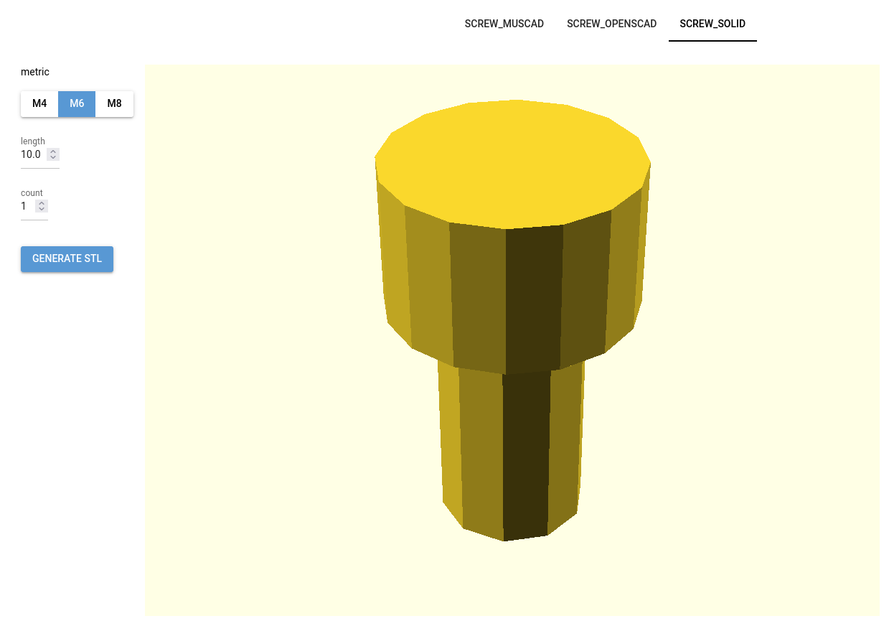

# openswebcad
A web interface to generate/publish parametric 3D models for openscad

## Quickstart
```
git clone https://github.com/hephaisto/openswebcad.git
docker run -p 8080:8080 --mount type=bind,src=/openswebcad/examples,dst=/root/models hephaisto123/openswebcad:latest
```

## Intro
Openswebcad (openscad+web) provides a python package (not via pypi at the moment, unfortunately) and a docker container to quickly publish parametric models.
The web interface allows numeric and choice inputs, which are given as parameters to a python function defined by the user.

The focus is on simplicity of deployment to allow quick usage for developers who expect maybe a visitor or two a month on their hobby project.
This influenced two major design decisions:
1. Rendering runs on the same node as the web interface. Professional deployments would probably have a dedicated rendering backend.
2. The "plugin" mechanism is quite simple: Just drop a python file in the correct folder. Professional deployments would probably package their model generation script. However, most hobby-CAD users probably don't want to learn the intricacies of python package management.




## Defining models

The application scans the `modelpath` for python files containing a `generate` function. 
These functions must abide the following rules:
* No parameters except the ones defined by the UI elements are allowed.
* Annotate each parameter
* Return an openscad script as a string

```python
from typing import Annotated, Literal

from openswebcad import IncompatibleParametersError, Range, Help
from solid2 import cube, cylinder, union

def generate(
        metric: Literal["M4", "M6", "M8"], 
        length: Annotated[float, Range(10.0, 100.0), Help("length of the screw (lower part only)")], 
        count: Annotated[int, Range(1, 4)],
        ) -> str:
    diameter, head_diameter, head_height = {
                    "M4": (4.0, 7.0, 4.0),
                    "M6": (6.0, 10.0, 6.0),
                    "M8": (8.0, 13.0, 8.0),
            }[metric]
    main = cylinder(h=length, d=diameter).down(length)
    head = cylinder(h=head_height, d=head_diameter)
    screw = main + head
    root = union()
    distance = 10.0
    for i in range(count):
        root += screw.right(i*distance)

    if count > 1 and head_diameter + 1.0 > distance :
        raise IncompatibleParametersError(["count", "metric"], "not possible to generate multiple screws - objects would collide")
    number = 1/(count-4) # enforce division by zero to check exception
    return str(root)
```

### Parameter annotations
The following types are supported:
* `Literal` will generate a choice selection
  * You can also wrap it into `Annotated` to add optional annotations
* `float`/`int` will generate a numeric input field
  * Numeric inputs require the `Range` annotation to define the min/max values for the numeric input
 
The following optional annotations are available:
* `Help`: Provides an additional help text (currently not displayed)

## Deploying

### Local install

#### Installation
You can install the `wheel` artifact using pip:
```
pip install openswebcad-*.whl
```
Unfortunately, there currently is no pypi package available, so you will need to download the package manually.

#### Web interface

```
openswebcad /path/to/model/files
```

#### Command line

You can also use the command line tool to generate models without opening a web interface, e.g. to test the glue code between openswebcad and your model:
```
$ OPENSWEBCAD_MODEL_PATH=./example openswebcad-cli out.stl screw_solid --help
usage: openswebcad-cli output screw_solid [-h] --metric {M4,M6,M8} --length LENGTH --count COUNT

options:
  -h, --help           show this help message and exit
  --metric {M4,M6,M8}
  --length LENGTH
  --count COUNT
```
Note: The path is given as an environment variable because the parameter parsing will depend on the model definitions found in this path.


### Docker
Add the python files which generate your models to `/root/models/`.
You can also mount a volume there, but the image does not contain any CAD libraries, so you need to install them to the python venv anyway.

```docker
FROM hephaisto123/openswebcad:latest

RUN /root/venv/bin/python3 -m pip install muscad solidpython2
COPY *.py /root/models/
```

By default, the service will listen on `:8080`.
